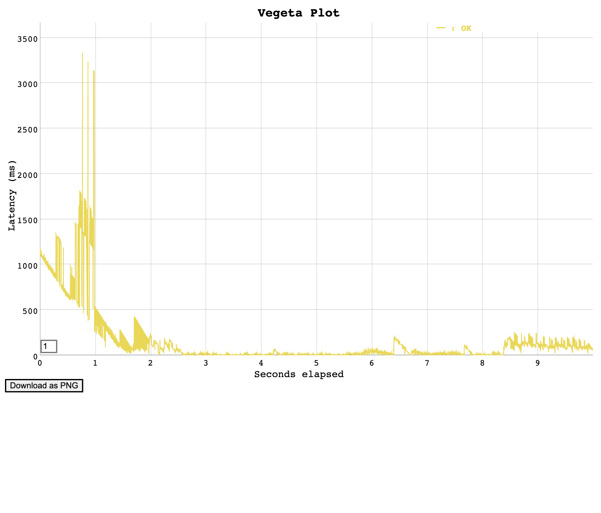
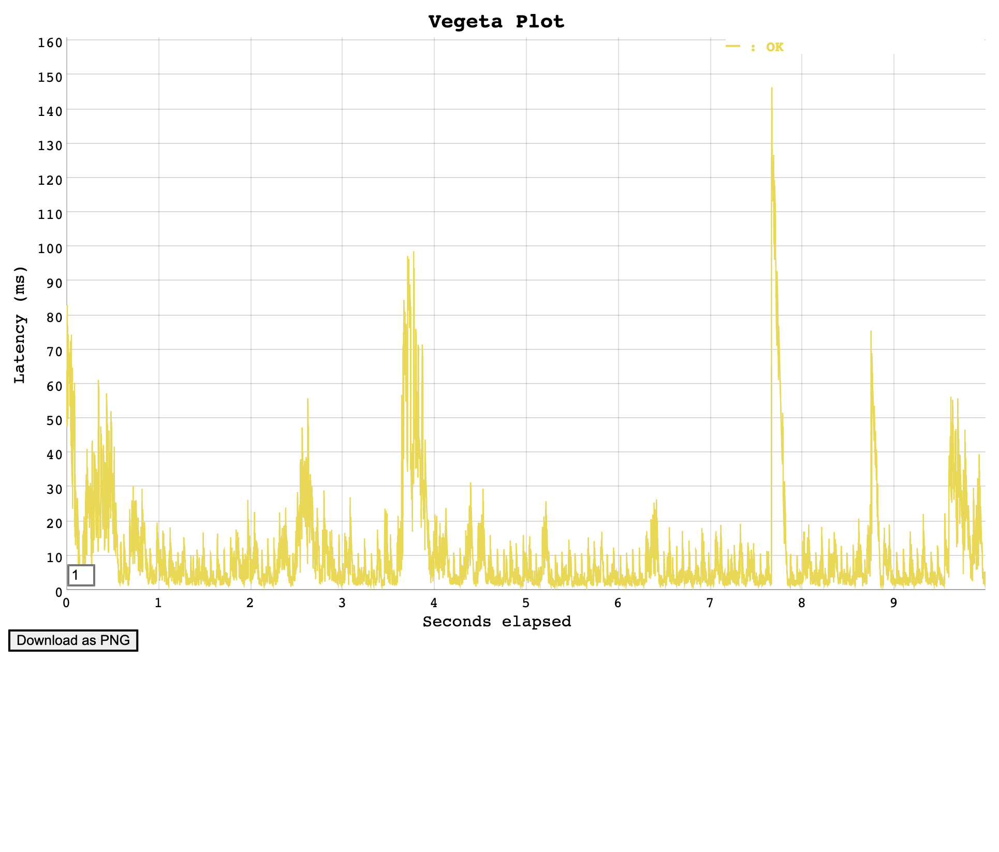

# Fever code challenge

This document explain for each version what was the mayor change and how well the benchmarks worked

We generate random urls to create a varity of escenaries to test

### Files:
`/test/generate-supplier-urls.js`
`/test/supplier.urls`

# Last Version:

## On start up



## After warmup





# Benchmarks results per version

| VERSION | Request Per Second | Test Type           | 95 startup  | 99 startup | 95 Warmup  | 99 Warmup |
|---------|--------------------|---------------------|-------------|------------|------------|-----------|
| 1       | 100                | Same Url            | 1.87s       | 5.37s      | NA         | NA        |
| 2       | 500                | Same Url            | 0.2s        | 6.9s       | NA         | NA        |
| 3       | 1000               | Same Url            | 1.874s      | 3.098s     | 571.497ms  | 1.479s    |
| 4       | 1000               | Same Url            | 3.165s      | 3.62s      | 124.364ms  | 1.091s    |
| 5       | 1000               | Sorted Random Url   | 17.015s     | 17.408s    | 688.578ms  | 1.119s    |
| 6       | 2000               | Sorted Random Url   | 872.179ms   | 1.26s      | 17.609ms   | 175.207ms |
| 7       |                    | Sorted Random Url   |             |            |            |           |
| 8       | 2000               | Sorted Random Url   | 96.165ms    | 209.042ms  | 49.832ms   | 143.844ms |
| 8       | 2000               | Unsorted Random Url | 1.251s      | 2.161s     | 146.301ms  | 263.507ms |

## Version 1

It will create a new connection to the database for each request

### 100 concurrent request


` 99% percentile in 5.3764 secs `


```
hey -n 20000 -c 100 "http://localhost:8002/events"

Summary:
  Total:        167.5426 secs
  Slowest:      10.8605 secs
  Fastest:      0.0169 secs
  Average:      0.8313 secs
  Requests/sec: 119.3726
  
  Total data:   8380000 bytes
  Size/request: 419 bytes

Response time histogram:
  0.017 [1]     |
  1.101 [17394] |■■■■■■■■■■■■■■■■■■■■■■■■■■■■■■■■■■■■■■■■
  2.186 [1844]  |■■■■
  3.270 [396]   |■
  4.354 [64]    |
  5.439 [117]   |
  6.523 [51]    |
  7.607 [42]    |
  8.692 [33]    |
  9.776 [43]    |
  10.861 [15]   |


Latency distribution:
  50% in 0.6002 secs
  90% in 1.3191 secs
  95% in 1.8723 secs
  99% in 5.3764 secs

Status code distribution:
  [200] 20000 responses
```


## Version 2

Reusing the same database connection until none operation requires it


### 100 concurrent request

` 99% percentile in 0.3634 secs `

```
make load-testing
hey -n 20000 -c 100 "http://localhost:8002/events"

Summary:
  Total:        19.3918 secs
  Slowest:      2.1326 secs
  Fastest:      0.0054 secs
  Average:      0.0937 secs
  Requests/sec: 1031.3636
  
  Total data:   8380000 bytes
  Size/request: 419 bytes

Response time histogram:
  0.005 [1]     |
  0.218 [19381] |■■■■■■■■■■■■■■■■■■■■■■■■■■■■■■■■■■■■■■■■
  0.431 [506]   |■
  0.644 [41]    |
  0.856 [14]    |
  1.069 [13]    |
  1.282 [6]     |
  1.494 [9]     |
  1.707 [10]    |
  1.920 [8]     |
  2.133 [11]    |


Latency distribution:
  50% in 0.0768 secs
  90% in 0.1310 secs
  95% in 0.1660 secs
  99% in 0.3634 secs

Status code distribution:
  [200] 20000 responses
```

### 500 concurrent request

` 99% percentile in 6.9128 secs`

` 19672 of 20000 requests succeeded `

```
 hey -n 20000 -c 500 "http://localhost:8002/events"

Summary:
  Total:        14.1075 secs
  Slowest:      10.2925 secs
  Fastest:      0.0102 secs
  Average:      0.2471 secs
  Requests/sec: 1417.6829
  
  Total data:   8242568 bytes
  Size/request: 419 bytes

Response time histogram:
  0.010 [1]     |
  1.038 [19275] |■■■■■■■■■■■■■■■■■■■■■■■■■■■■■■■■■■■■■■■■
  2.067 [47]    |
  3.095 [38]    |
  4.123 [28]    |
  5.151 [28]    |
  6.180 [24]    |
  7.208 [107]   |
  8.236 [62]    |
  9.264 [34]    |
  10.293 [28]   |


Latency distribution:
  50% in 0.1287 secs
  90% in 0.1940 secs
  95% in 0.2184 secs
  99% in 6.9128 secs

Status code distribution:
  [200] 19672 responses
```

## VERSION 3

This time we added a LRUCache with 5 min of ttl to avoid duplicate request to the Database

### 500 concurrents request

` 99% percentile in 3.2239 secs `

` 19383 of 20000 requests succeeded `

```
hey -n 20000 -c 500 "http://localhost:8002/events"

Summary:
  Total:        5.6331 secs
  Slowest:      4.0543 secs
  Fastest:      0.0010 secs
  Average:      0.1085 secs
  Requests/sec: 3550.4399
  
  Total data:   8121477 bytes
  Size/request: 419 bytes

Response time histogram:
  0.001 [1]     |
  0.406 [18902] |■■■■■■■■■■■■■■■■■■■■■■■■■■■■■■■■■■■■■■■■
  0.812 [83]    |
  1.217 [40]    |
  1.622 [59]    |
  2.028 [7]     |
  2.433 [13]    |
  2.838 [77]    |
  3.244 [10]    |
  3.649 [76]    |
  4.054 [115]   |


Latency distribution:
  10% in 0.0176 secs
  25% in 0.0274 secs
  50% in 0.0508 secs
  75% in 0.0683 secs
  90% in 0.0898 secs
  95% in 0.1060 secs
  99% in 3.2239 secs

Details (average, fastest, slowest):
  DNS+dialup:   0.0017 secs, 0.0010 secs, 4.0543 secs
  DNS-lookup:   0.0003 secs, 0.0000 secs, 0.0285 secs
  req write:    0.0000 secs, 0.0000 secs, 0.0078 secs
  resp wait:    0.1067 secs, 0.0010 secs, 3.9484 secs
  resp read:    0.0000 secs, 0.0000 secs, 0.0167 secs

Status code distribution:
  [200] 19383 responses

```

### VEGETA: 1000 request concurrent

Using vegeta benchmark tool

` 99% percentile in 3.098 secs `

```
Requests      [total, rate, throughput]         10000, 1000.14, 1000.01
Duration      [total, attack, wait]             10s, 9.999s, 1.236ms
Latencies     [min, mean, 50, 90, 95, 99, max]  611µs, 182.621ms, 1.623ms, 74.65ms, 1.874s, 3.098s, 3.148s
Success       [ratio]                           100.00%
```

### VEGETA: 1000 request concurrent - after warmup

` 99% percentile in 571.497ms `

```
Requests      [total, rate, throughput]         10000, 1000.19, 1000.06
Duration      [total, attack, wait]             9.999s, 9.998s, 1.313ms
Latencies     [min, mean, 50, 90, 95, 99, max]  559.417µs, 71.153ms, 1.432ms, 34.449ms, 571.497ms, 1.479s, 1.515s
Success       [ratio]                           100.00%
```

## Version 4

We enable gzip as a compressor method for the response;

### VEGETA 1000 request concurrent

`It doesn't seems to improve the the performance`

```
Requests      [total, rate, throughput]         20000, 1000.05, 999.99
Duration      [total, attack, wait]             20s, 19.999s, 1.176ms
Latencies     [min, mean, 50, 90, 95, 99, max]  606.208µs, 287.723ms, 1.703ms, 236.926ms, 3.165s, 3.62s, 7.186s
Success       [ratio]                           100.00%
```

`After warpup`

```
Requests      [total, rate, throughput]         20000, 1000.05, 999.99
Duration      [total, attack, wait]             20s, 19.999s, 1.151ms
Latencies     [min, mean, 50, 90, 95, 99, max]  616.333µs, 36.999ms, 1.404ms, 22.324ms, 124.364ms, 1.091s, 1.161s
Success       [ratio]                           100.00%
Error Set:

```

## 1000 requests concurrent with new test

Update the way that supplier.url was generated, increasing the complexity

` 99% percentile less than 7s after warmup ` 

```
On startUp:

Latencies     [min, mean, 50, 90, 95, 99, max]  610.292µs, 344.961ms, 5.101ms, 157.647ms, 2.723s, 7.159s, 7.949s

After warmup:

Latencies     [min, mean, 50, 90, 95, 99, max]  578.166µs, 1.109s, 27.113ms, 4.907s, 7.786s, 15.59s, 16.482s
Latencies     [min, mean, 50, 90, 95, 99, max]  613.917µs, 33.812ms, 2.242ms, 41.838ms, 64.541ms, 1.306s, 1.909s
Latencies     [min, mean, 50, 90, 95, 99, max]  713.417µs, 834.828ms, 55.383ms, 796.533ms, 5.438s, 16.256s, 16.783s

```

## Version 5

Migrate to hyper-express server and ingress cache to 10k elements

### 1000 requests concurrent with new tests

` 99% percentile less than 1.120s after warmup ` 

```
On startUp:

Latencies     [min, mean, 50, 90, 95, 99, max]  1.338ms, 8.8s, 8.314s, 16.645s, 17.015s, 17.408s, 19.407s

After warmup:

Latencies     [min, mean, 50, 90, 95, 99, max]  532.542µs, 1.566s, 44.147ms, 5.437s, 5.889s, 6.466s, 7.267s
Success       [ratio]                           99.29%
Latencies     [min, mean, 50, 90, 95, 99, max]  476.666µs, 37.193ms, 1.522ms, 83.013ms, 258.476ms, 613.918ms, 701.369ms
Success       [ratio]                           100.00%
Latencies     [min, mean, 50, 90, 95, 99, max]  532.917µs, 82.032ms, 3.125ms, 280.294ms, 568.028ms, 948.338ms, 1.08s
Success       [ratio]                           100.00%
Latencies     [min, mean, 50, 90, 95, 99, max]  493.791µs, 80.879ms, 1.5ms, 211.016ms, 688.578ms, 1.119s, 1.233s
Success       [ratio]                           100.00%
```

## Version 6

Apply a new search strategy by week

### 1000 requests concurrents with new test

` 99% percentile less than 100ms after warmup ` 

```
On startUp:

Latencies     [min, mean, 50, 90, 95, 99, max]  530.958µs, 1.653s, 1.138s, 4.193s, 5.098s, 5.92s, 6.509s
Success       [ratio]                           99.78%

After warmup:

Latencies     [min, mean, 50, 90, 95, 99, max]  483.25µs, 35.658ms, 1.063ms, 23.088ms, 245.151ms, 785.36ms, 1.041s
Success       [ratio]                           100.00%
Latencies     [min, mean, 50, 90, 95, 99, max]  499.417µs, 3.978ms, 1.14ms, 8.199ms, 13.189ms, 62.679ms, 156.445ms
Success       [ratio]                           100.00%
Latencies     [min, mean, 50, 90, 95, 99, max]  490.875µs, 3.147ms, 1.105ms, 7.153ms, 11.04ms, 34.309ms, 90.955ms
Success       [ratio]                           100.00%
```

### 2000 requests concurrents with new test

` 99% percentile less than 120ms on average after warmup ` 

```
Latencies     [min, mean, 50, 90, 95, 99, max]  490.291µs, 92.794ms, 1.496ms, 268.473ms, 872.179ms, 1.26s, 1.54s
Success       [ratio]                           99.64%

After warmup:

Latencies     [min, mean, 50, 90, 95, 99, max]  488.083µs, 4.837ms, 1.507ms, 5.763ms, 14.525ms, 85.857ms, 176.554ms
Success       [ratio]                           100.00%
Latencies     [min, mean, 50, 90, 95, 99, max]  538.542µs, 2.883ms, 1.622ms, 5.422ms, 9.452ms, 21.643ms, 146.206ms
Success       [ratio]                           100.00%
Latencies     [min, mean, 50, 90, 95, 99, max]  531.75µs, 6.96ms, 1.474ms, 6.925ms, 17.609ms, 175.207ms, 358.382ms
Success       [ratio]                           100.00%
```

## Version 8

Using Redis to handle the cache of the timespan of events

### 2000 requests concurrents with new test

```
On startUp:

Latencies     [min, mean, 50, 90, 95, 99, max]  735.875µs, 18.163ms, 5.479ms, 35.957ms, 96.165ms, 209.042ms, 344.193ms
Success       [ratio]                           100.00%

After warmup:

Latencies     [min, mean, 50, 90, 95, 99, max]  700.333µs, 38.923ms, 4.653ms, 89.851ms, 272.71ms, 518.837ms, 778.088ms
Success       [ratio]                           99.36%
Latencies     [min, mean, 50, 90, 95, 99, max]  802.666µs, 11.645ms, 3.376ms, 21.309ms, 49.832ms, 143.844ms, 202.304ms
Success       [ratio]                           100.00%
Latencies     [min, mean, 50, 90, 95, 99, max]  716.084µs, 7.318ms, 2.848ms, 17.183ms, 21.738ms, 77.306ms, 159.864ms
Success       [ratio]                           100.00%
```


### 2000 requests concurrents with unsorted random urls

```
On startUp:

Latencies     [min, mean, 50, 90, 95, 99, max]  703.875µs, 163.778ms, 5.782ms, 738.162ms, 1.251s, 2.161s, 3.533s
Success       [ratio]                           99.79%

After warmup:

Latencies     [min, mean, 50, 90, 95, 99, max]  758.792µs, 13.792ms, 3.671ms, 31.071ms, 71.264ms, 139.183ms, 231.627ms
Success       [ratio]                           100.00%
Latencies     [min, mean, 50, 90, 95, 99, max]  749.459µs, 149.875ms, 7.341ms, 722.593ms, 1.019s, 1.612s, 1.977s
Success       [ratio]                           98.83%
Latencies     [min, mean, 50, 90, 95, 99, max]  756.417µs, 10.372ms, 3.37ms, 20.148ms, 41.549ms, 148.682ms, 190.803ms
Success       [ratio]                           100.00%
Latencies     [min, mean, 50, 90, 95, 99, max]  720.208µs, 9.397ms, 3.7ms, 20.792ms, 31.763ms, 93.007ms, 156.056ms
Success       [ratio]                           100.00%
Latencies     [min, mean, 50, 90, 95, 99, max]  689.125µs, 19.643ms, 3.816ms, 32.252ms, 146.301ms, 263.507ms, 367.928ms
Success       [ratio]                           100.00%
```
